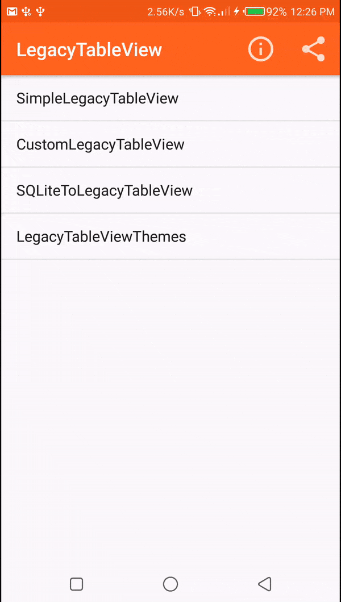

# LegacyTableView
simple light weight android library for displaying tabulated data

This is a simple android library that will help you include tables in your projects using a few lines of code.
Follow very simple examples in the sample LegcyTableView project. Write data dynamically, translate into different languages,
update themes, colors, fonts etc...


 Application Demo


# Examples
This project covers the following examples
1. Simple display of data
2. Custom controls for the LegacyTableView
3. Adding data from database (SQLite)
4. Using different LegacyTableViewThemes

[](https://play.google.com/store/apps/details?id=com.levitnudi.fancytableview)


# Get started...

Add jitpack.io to your root gradle file

 ```gradle
             allprojects {
		repositories {
			...
			maven { url 'https://jitpack.io' }
		}
	} 
      

 ```


 Add this to your dependencies method in build.gradle file              

 
 ```gradle
       dependencies {
	                implementation 'com.github.levitnudi:LegacyTableView:1.2'
	}


	             } 
      

 ```
     
   

	 
	
Add the following lines...

1. In your xml layout add:


 ```xml
        <com.levitnudi.legacytableview.LegacyTableView
        android:id="@+id/legacy_table_view"
        android:layout_width="match_parent"
        android:layout_height="match_parent"/>
      

 ```
 
 2. In your activity add:
 
  ```java
          //set table title labels
        LegacyTableView.insertLegacyTitle("Id", "Name", "Age", "Email");
        //set table contents as string arrays
        LegacyTableView.insertLegacyContent("2999010", "John Deer", "50", "john@example.com",
                "332312", "Kennedy F", "33", "ken@example.com"
                ,"42343243", "Java Lover", "28", "Jlover@example.com"
                ,"4288383", "Mike Tee", "22", "miket@example.com");

        LegacyTableView legacyTableView = (LegacyTableView)findViewById(R.id.legacy_table_view);
        legacyTableView.setTitle(LegacyTableView.readLegacyTitle());
        legacyTableView.setContent(LegacyTableView.readLegacyContent());
        
        //depending on the phone screen size default table scale is 100
        //you can change it using this method
        //legacyTableView.setInitialScale(100);//default initialScale is zero (0)
        
        //if you want a smaller table, change the padding setting
        legacyTableView.setTablePadding(7);
        
        //to enable users to zoom in and out:
        legacyTableView.setZoomEnabled(true);
        legacyTableView.setShowZoomControls(true);

        //remember to build your table as the last step
        legacyTableView.build();
      

 ```
 
 
 
  3. Using Themes:
 
  ```java
          //set table title labels
        LegacyTableView.insertLegacyTitle("Id", "Name", "Age", "Email");
        //set table contents as string arrays
        LegacyTableView.insertLegacyContent("2999010", "John Deer", "50", "john@example.com",
                "332312", "Kennedy F", "33", "ken@example.com"
                ,"42343243", "Java Lover", "28", "Jlover@example.com"
                ,"4288383", "Mike Tee", "22", "miket@example.com");

        LegacyTableView legacyTableView = (LegacyTableView)findViewById(R.id.legacy_table_view);
        legacyTableView.setTitle(LegacyTableView.readLegacyTitle());
        legacyTableView.setContent(LegacyTableView.readLegacyContent());
        
        //Add your preferred theme like this:
        legacyTableView.setTheme(GOLDALINE);
        
        /*
        Explore available themes
        OCEAN
        LAVICI
        GOLDALINE
        ECOKENYA
        DESKTOP
        MAASAI
        LEVICI
        ORIO
        SKELETON
        MESH*/
        
        //depending on the phone screen size default table scale is 100
        //you can change it using this method
        //legacyTableView.setInitialScale(100);//default initialScale is zero (0)
        
        //if you want a smaller table, change the padding setting
        legacyTableView.setTablePadding(7);
        
        //to enable users to zoom in and out:
        legacyTableView.setZoomEnabled(true);
        legacyTableView.setShowZoomControls(true);

        //remember to build your table as the last step
        legacyTableView.build();
      

 ```
 
 
 4. Display from database:
 
 
   ```java
        public void getFromDatabase(){//execute this method to fetch from database

        Cursor cursor =  db.rawQuery("SELECT * FROM legacy_table", null);

        if(cursor.getCount()>0){
               //use database column names or custom names for the columns
               /* insert your column titles using legacy insertLegacyTitle() function*/
               LegacyTableView.insertLegacyTitle(cursor.getColumnName(1), cursor.getColumnName(2),
                       cursor.getColumnName(3), cursor.getColumnName(4));
        }
        while(cursor.moveToNext()) {
            //simple table content insert method for table contents
            LegacyTableView.insertLegacyContent(cursor.getString(1),
                    cursor.getString(2), cursor.getString(3), cursor.getString(4));
        }
        //remember to close your database to avoid memory leaks
        cursor.close();
    }
    
    //then do this to display it on the table
     LegacyTableView legacyTableView = (LegacyTableView)findViewById(R.id.legacy_table_view);
        //once you have inserted contents and titles, you can retrieve them
        //using readLegacyTitle() and readLegacyContent() methods
        legacyTableView.setTitle(LegacyTableView.readLegacyTitle());
        legacyTableView.setContent(LegacyTableView.readLegacyContent());

        //remember to build your table as the last step
        legacyTableView.build();
      

 ```
 
 
  4. Using custom controls:
 
 
   ```java
           final LegacyTableView tableView = (LegacyTableView)findViewById(R.id.legacy_table_view);
        /*
        [OPTIONAL] default column seperator characters are (د) character
        default row seperator is (\n) character
        you may need to change if your set of data contains these characters
        if you don't change the seperators, any character similar in your data set
        will be excluded in your table. It is therefore adviseable to use least
        commonly used characters
        tableView.setColumnSeperator("'");
        tableView.setRowSeperator("\n");
        tableView.setLegacyColumnSeperator("'");*/

        //set table title labels
        LegacyTableView.insertLegacyTitle("Id", "Name", "Age", "Email");
        //set table contents as string arrays
        LegacyTableView.insertLegacyContent("2999010", "John Deer", "50", "john@example.com",
                "332312", "Kennedy F", "33", "ken@example.com"
                ,"42343243", "Java Lover", "28", "Jlover@example.com"
                ,"4288383", "Mike Tee", "22", "miket@example.com");
        //make sure to indicate custom as other features may not work with default table theme
        tableView.setTheme(CUSTOM);
        //get titles and contents
        tableView.setContent(LegacyTableView.readLegacyContent());
        tableView.setTitle(LegacyTableView.readLegacyTitle());
        tableView.setBottomShadowVisible(true);

        tableView.setHighlight(ODD);//highlight rows oddly or evenly
        //tableView.setHighlight(EVEN);
        tableView.setBottomShadowVisible(true);
        tableView.setFooterTextAlignment(CENTER);

        tableView.setFooterText(getString(R.string.footer_text));
        tableView.setTableFooterTextSize(5);
        tableView.setTableFooterTextColor("#009688");

        tableView.setTitleTextAlignment(CENTER);
        tableView.setContentTextAlignment(CENTER);
        tableView.setTablePadding(20);//increasing spacing will increase the table size
        //tableView.setBottomShadowColorTint("#ffffff");

        //tableView.setBackgroundEvenColor("#FFCCBC");
        //tableView.setBackgroundEvenColor("#303F9F");
        tableView.setBackgroundOddColor("#FFCCBC");
        //you can also declare your color values as global strings to make your work easy :)
        tableView.setHeaderBackgroundLinearGradientBOTTOM("#FF5722");//header background bottom color
        tableView.setHeaderBackgroundLinearGradientTOP("#009688");//header background top color
        tableView.setBorderSolidColor("#009688");
        tableView.setTitleFont(BOLD);
        tableView.setZoomEnabled(true);
        tableView.setShowZoomControls(true);
        //by default the initial scale is 0, you
        // may change this depending on initiale scale preferences
        //tableView.setInitialScale(100);//default initialScale is zero (0)
        tableView.setContentTextColor("#009688");
        tableView.build();
      

 ```
 

 ```
         Copyright 2018 Levit Nudi

Licensed under the Apache License, Version 2.0 (the "License");
you may not use this file except in compliance with the License.
You may obtain a copy of the License at

  http://www.apache.org/licenses/LICENSE-2.0

Unless required by applicable law or agreed to in writing, software
distributed under the License is distributed on an "AS IS" BASIS,
WITHOUT WARRANTIES OR CONDITIONS OF ANY KIND, either express or implied.
See the License for the specific language governing permissions and
limitations under the License.
      

 ```
 
# Author : Levit Nudi [](https://www.linkedin.com/in/levitnudi/)

[](https://levitnudi7.wixsite.com/legacy)
